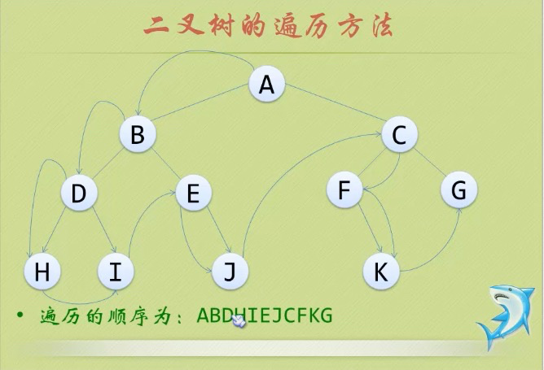
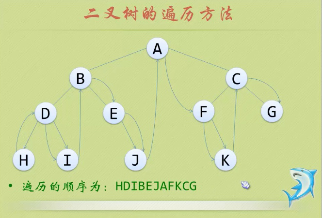
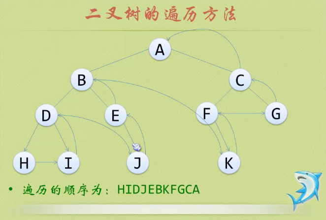

# 二叉树遍历算法

> 深度优先搜索（DFS）：前序遍历、中序遍历、后序遍历。  
> 广度优先搜索（BFS）：层次遍历。

## 前序遍历


## 中序遍历


## 后序遍历


## 层次遍历


```java
public class BinaryTree {

  // 二叉树结点
  public class Node {
    public int value;
    public Node left;
    public Node right;
  }
  
  // 前序遍历（递归）：中左右
  public void pre(Node root) {
    if (root != null) {
      System.out.print(root.value);
      pre(root.left);
      pre(root.right);
    }
  }
  
  // 中序遍历（递归）：左中右
  public void in(Node root) {
    if (root != null) {
      in(root.left);
      System.out.print(root.value);
      in(root.right);
    }
  }
  
  // 后序遍历（递归）：左右中
  public void post(Node root) {
    if (root != null) {
      post(root.left);
      post(root.right);
      System.out.print(root.value);
    }
  }
  
  // 层次遍历（非递归）：从左到右，从上到下
  // 队列
  public void layer(Node root) {
    Queue<Node> queue = new ArrayDeque<Node>();
    
    if (root != null) {
      queue.offer(root);
    }
    
    while (!queue.isEmpty()) {
      Node node = queue.poll();
      System.out.print(node.value);
      
      if (node.left != null) {
        queue.offer(node.left);
      }
      
      if (node.right != null) {
        queue.offer(node.right);
      }
    }
  }
  
  // 前序遍历（非递归）：中左右
  // 栈
  public void pre2(Node root) {
    Stack<Node> stack = new Stack<Node>();
    
    if (root != null) {
      stack.push(root);
    }
    
    while (!stack.empty()) {
      Node node = stack.pop();
      System.out.print(node.value);
  
      if (node.right != null) {
        stack.push(node.right);
      }
      
      if (node.left != null) {
        stack.push(node.left);
      }
    }
  }

  // 中序遍历（非递归）：左中右
  // 栈
  public void in2(Node root) {
    Stack<Node> stack = new Stack<Node>();
    
    while (root != null || !stack.empty()) {
      while (root != null) {
        stack.push(root);
        root = root.left;
      }
      
      if (!stack.empty()) {
        Node node = stack.pop();
        System.out.print(node.value);
        
        root = node.right;
      }
    }
  }
  
  // 后序遍历（非递归）：左右中
  // 栈
  public void post2(Node root) {  
    Stack<Node> stack1 = new Stack<Node>();      
    Stack<String> stack2 = new Stack<String>();   
    
    while (root != null || !stack1.empty()) {
      while (root != null) {
        stack1.push(root);
        root = root.left;
        
        stack2.push("l");
      }
      
      if (stack2.peek().equals("l")) {
          root = stack1.peek().right;
          
        stack2.pop();              
        stack2.push("r");             
        
      } else {
        Node node = stack1.pop();
        System.out.print(node.value);
        
        stack2.pop();
      }
    }
  }
  
  // 求树高
  public int getHeight(Node root) {
    if (root != null) {
      int h1 = getHeight(root.left) + 1;
      int h2 = getHeight(root.right) + 1;
      return (h1 > h2) ? h1 : h2;
    }
    return 0;
  }
  
  // 求叶子总数
  public int getLeavesCount(Node root) {
    if (root != null) {
      if (root.left == null && root.right == null)
        return 1;
        
      return getLeavesCount(root.left) + getLeavesCount(root.right);
    }
    return 0;
  }
}
```