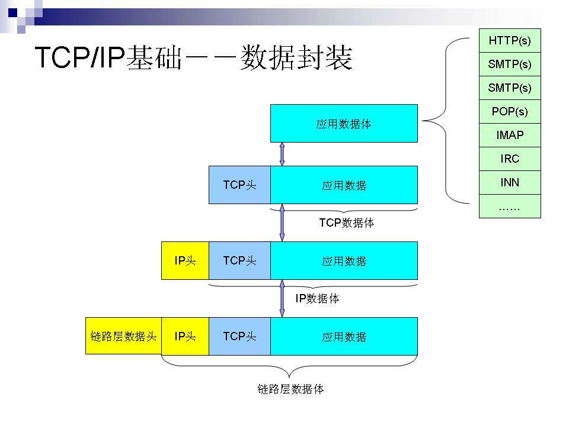
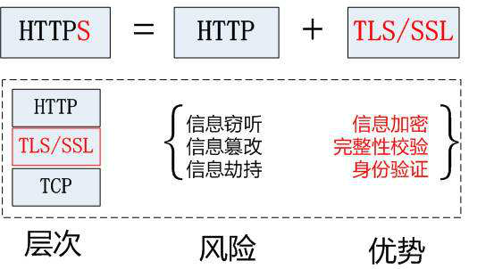
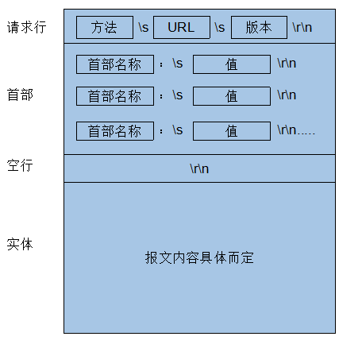
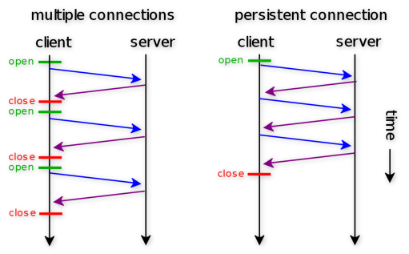
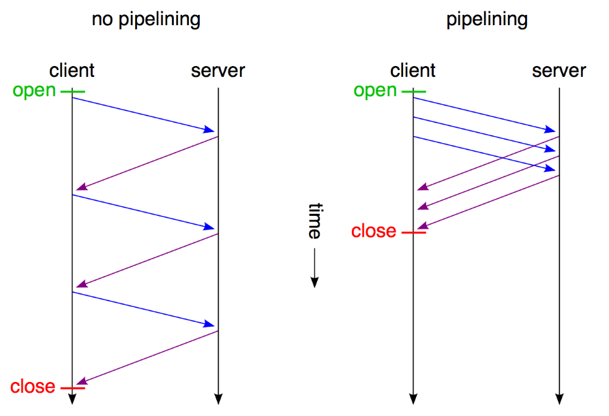
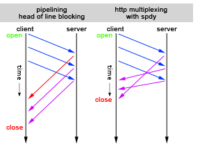
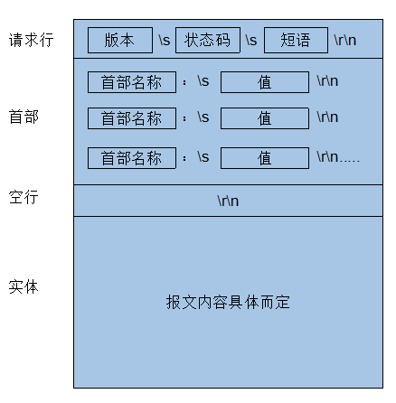

# HTTP

## HTTP 的基本原理
HTTP（**H**yper**T**ext **T**ransfer **P**rotocol ，超文本传输协议），这是互联网上应用最为广泛的一种网络协议，设计 HTTP 最初的目的是为了提供一种发布和接收 HTML 页面的方法，当然，它现在已经不再局限于用于 HTML 的传输，而是可以运用在任何需要它传输你想传输数据的场景中。

### # 网络分层模型


### # 报文封装过程


### # TCP 的连接过程


### # HTTPS 的简单介绍



## HTTP 的具体协议

### # 请求报文


```
POST /index.html HTTP/1.1
Host: www.qq.com
Connection: keep-alive
Accept-Encoding: gzip, deflate, sdch
Accept-Language: zh-CN,zh;q=0.8

name=adam&sex=man&age=25
```

#### $ 方法
* GET：请求资源。
* POST：提交数据。
* PUT：提交数据。
* DELETE：删除资源。
* ...

>**GET 与 POST**
>
>GET 请求的参数是通过 URL 传递的，POST 请求的参数则放在 Body 中，所以 GET 请求比 POST 请求更不安全，因为参数直接暴露在了 URL 上。

>**PUT 与 POST**
>
>PUT 请求通常指定了资源的存放地址，而 POST 请求的资源存放地址一般由服务器自己决定。  
>
> 比如，一个用于发表文章的 URL，/addArticle。如果严格按照协议定义的话， PUT 方法提交的 URL 会是形如 /addArticle/abc123，其中 abc123 是这个文章的地址；而 POST 方法提交的 URL 还是 /addArticle，但这个文章的地址会在提交后由服务器告知客户端。

>**RESTful**
>
>/user POST 新增用户   
/user GET 查询用户    
/user PUT 修改用户    
/user DELETE 删除用户    

>**CRUD**  
>
>Create -> POST  
Read -> GET  
Update -> PUT  
DELETE - > DELETE

#### $ URL（Uniform Resource Locator，统一资源定位符）
协议://域名:端口/路径

```
http://www.qq.com:80/index.html
```

#### $ 版本
* HTTP/0.9：已过时，第一代，只支持短连接。
* HTTP/1.0：还存在，默认短连接（请求串行，响应串行）。
* HTTP/1.1：很流行，默认长连接，流水线技术（请求并行，响应串行）。
* HTTP/2.0：非常少，下一代，多路复用（请求并行，响应并行）。

##### HTTP/0.9 与 HTTP/1.0：


##### HTTP/1.0 与 HTTP/1.1：


##### HTTP/1.1 与 HTTP/2.0：



#### $ 首部
* Accept：告诉服务器能够发送哪些类型的数据。
* Accept-Encoding：告诉服务器能够发送哪些编码方式。
* Accept-Language：告诉服务器能够发送哪些语言。
* User-Agent：告诉服务器发起请求的客户端的类型。
* Content-Type：请求的数据内容类型
* Connection：决定是短连接还是长连接。
* Host：请求的服务器的主机名。
* Cookie：包含有关用户的信息。
* ...

#### $ 空行
呃，空行就是空行。

首部为了提高可读性会被分为多行来提高可读性，将其值划分为多个延续行，每个延续行的前面会有空格符、或换行符、或回车符。

#### $ 实体
真正的数据部分。

### # 响应报文



```
HTTP/1.1 200 OK
Content-Language: zh-CN
Content-Encoding: gzip
Content-Length: 7333
Content-Type: text/html;charset=UTF-8
Set-Cookie: JSESSIONID=84C993F5E433;path=/;HttpOnly

<html><head></head><body></body></html>
```

#### $ 版本
同请求报文。

#### $ 状态码
* 1xx：信息类。
* 2xx：成功类。
  * 200：响应成功。
* 3xx：重定向类。
  * 301：永久重定向。
  * 302：临时重定向。
* 4xx：客户端类。
  * 403：禁止访问。
  * 404：资源不存在。
* 5xx：服务端类。
  * 500：服务器无法完成请求。
  * 502：网关错误。
  * 503：服务器不可用。
  

#### $ 短语
短语是和状态码相对应的，比如，200 对应的 OK，404 对应 Not Found，403 对应的 Forbidden。

#### $ 首部
* Content-Type：响应的数据内容类型。
* Content-Encoding：响应的数据内容编码。
* Content-Length：响应的数据内容长度。
* Content-Language：响应的数据内容语言。
* Set-Cookie：告诉客户端设置的Cookie内容。
* ...

#### $ 空行
同请求报文。

#### $ 实体
同请求报文。

## HTTP 的调试方法
在开发中，如果是一个基于 HTTP 协议通信的应用，那么常常需要对 HTTP 请求进行调试，比如你可能需要查看这个请求的返回结果是否符合预期。

>**调试原理**
>
>把请求的方法、URL、首部、实体部通过一些 HTTP API 进行模拟请求即可。 

### # 直接编写代码

### # Postman 等工具

